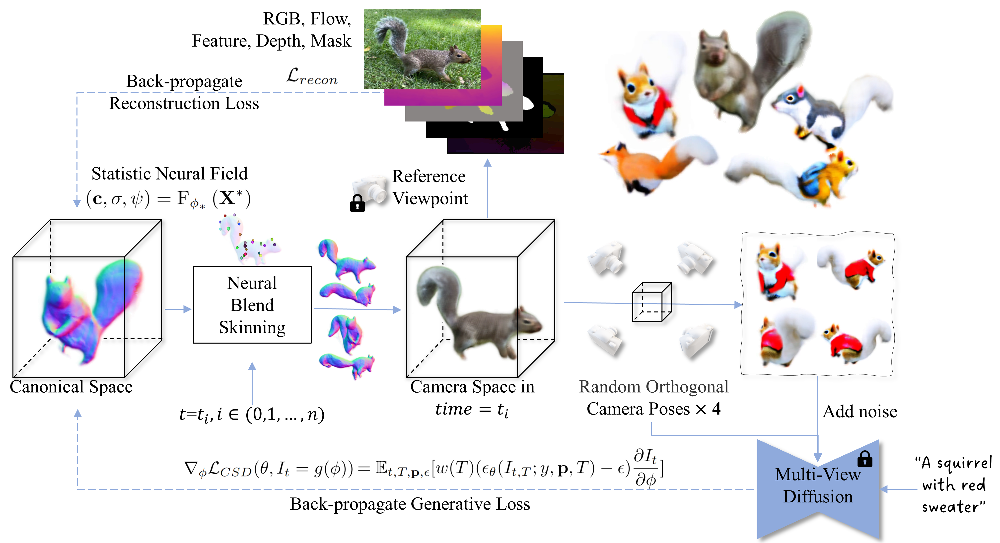

# AnimatableDreamer
Offical implementation of the paper "AnimatableDreamer: Text-Guided Non-rigid 3D Model Generation and Reconstruction with Canonical Score Distillation"
For video results, please visit our project page at https://animatabledreamer.github.io.

The code will be released after our paper is accepted.
